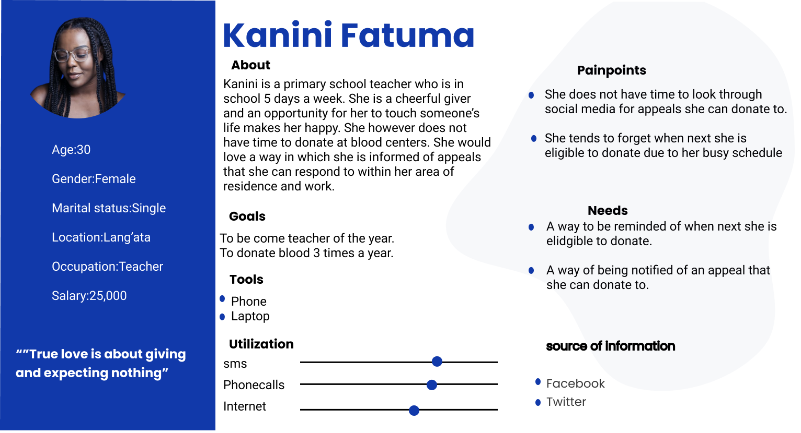
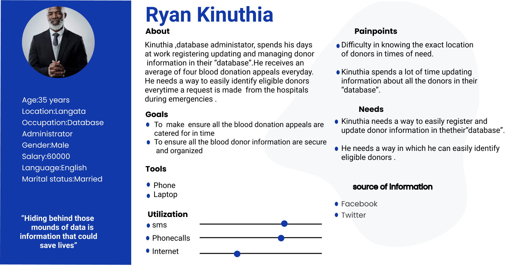
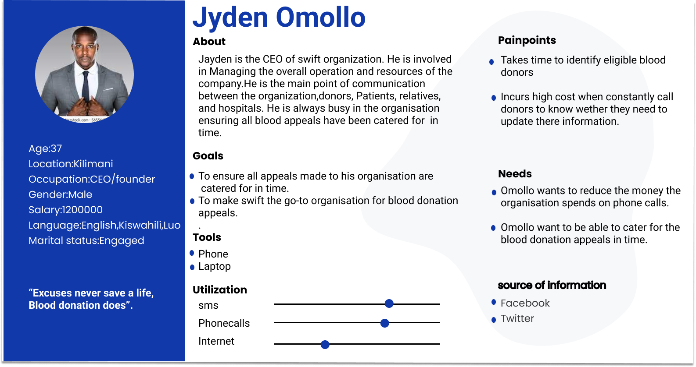
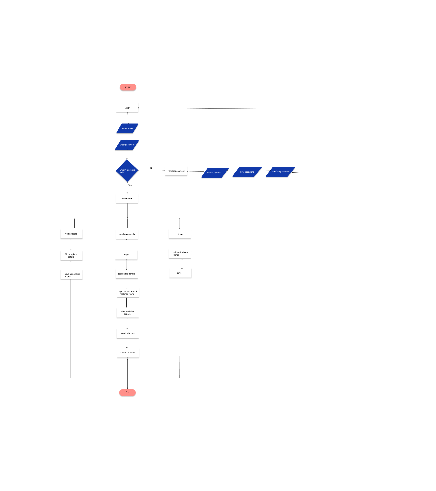
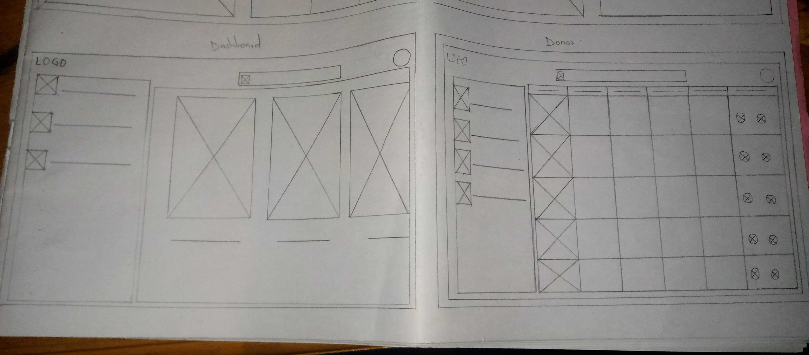

# RedSwift
## Background
 At the beginning of the 21st century, the development and expansion of ICT in healthcare management have been the trend of healthcare innovation and development in all parts of the world, with the wide application and speedy development of information technology solutions that regard computer technique, network technique and multimedia application technique as core (Kumar, Stem &Anderson, 2003). 

 There is a constant need for a regular supply of blood because it can be stored only for a limited period of time before use. Regular blood donation by a sufficient number of healthy people is needed to ensure that blood will always be available whenever and wherever it is needed.

 Blood is the most precious gift that anyone can give to another person – the gift of life. A decision to donate your blood can save a life, or even several if your blood is separated into its components – red cells, platelets and plasma – which can be used individually for patients with specific conditions.It is to this response that blood donor organisations came to be .They connect donors to patients in need of blood , however, their efforts are sometimes downplayed by the fact that they do not have a reliable way for them to manage their donor information which inturn makes it a hard task for them to identify an eligible donor for a particular appeal.

 In the quest to improve blood donor management, we decided to come up with a dashboard that makes the process of identifying eligible donors easier.

## Problems the product aims to solve

* Make it easier for blood donor organizations to identify eligible donors.
* Provide a tool for blood donor organization to store their donors' information.
* Provide a way for blood donor organizations to store their donor information in a secure way.

## Users

* Blood donor organisations

# Personas

*persona 1 : donor*
{ align=left }

*persona 2 : Database administrator*
{ align=left }

*persona 3 : Blood donor organizations founder*
{ align=left }

# Product user flow
{ align=left }

# Product design sketches
{ align=left }

{ align=left }

{ align=left }

**Link to the actuall designs**
[Figma link ](https://www.figma.com/file/le57ZifCulOTbv9c8OmG70/Red-Swift-Blood-donor-management-system-designs?node-id=663%3A2)

# Features of the product

**Custom fields**
ustom fields are an indispensable feature of professional business dashboard software. On the one hand, they allow users to create individual calculated fields and, on the other, to combine several category fields (dimensions) into a merged field with the help of different join types. This also enables business users to create calculations from several fields from different data sources without having to adapt the underlying data sources. With modern dashboard solutions such as datapine, custom fields can be easily created via drag & drop and a variety of different functions.

**Dashboard filter options**
The second important feature is the hierarchical filter, where the selection from one filter influences the selection of another. Besides having a standard global dashboard filter (that filters the whole dashboard for selected variables with a few clicks), hierarchical filters help you to manage related filters effectively. For example, you select an eligible donor and automatically the related to the blood type or dates last donated filter selects the relevant donors of the concrete category. 

**User role management**
Another critical feature of a professional dashboard application is the opportunity to assign different user roles and adjust various forms of access and data exploration. There are 4 main pillars you should look for: admin, viewer, power viewer, and user. Each of these roles has different workflow possibilities that make the analysis even easier:

*Admin*: As in many other software and tools, the admin is the highest level of administration capability where s/he has the ultimate power to add other users, restrict data access or adjust the account in any way that s/he sees fit, e.g. assign filters for dashboard viewers, or add, delete and edit data sources and dashboards.

*Editor*: The editor is one level lower than the admin; the difference is that s/he cannot delete data sources, but has access to dashboards, which s/he can edit or assign viewers’ access.

*Power viewer*: This type of a viewer has access to a chart library that the admin assigned and s/he can edit the charts’ appearances, but can’t create a new chart on his/her own. The power viewer cannot manage the data source but can add other viewers, e.g. in bulk, if you have multiple sales managers or departments and bigger teams.

# Development requirements

**Languages**

* Python

* HTML/CSS

* Bootstrap

**Framework**

**Django**
It can work with any client-side framework and can deliver content in almost any format (HTML, JSON, XML, etc)
Django provides a secure way to manage user accounts and passwords, donor information is really sensitive and needs to be secure from unauthorized users.

**Twilio**

Twilio allows software developers to programmatically make and receive phone calls, send and receive text messages and perform other communication functions using its web service APIs.
Twilio offers a 30-day free trial.
Twilio APIs are available online in their documentation.

**Heroku** 

Heroku is a platform as a service (Paas) that enables developers to build, run and operate applications entirely in the cloud.
Heroku offers a free plan to experiment and find out what works best for you.
Heroku supports the Python programming language.

**PostgreSQL database**

Postgres is a free and open-source database management system that is extensible and SQL compliant
Postgresql source code is freely available under an open-source license
Postgres has a filter clause that can be used to aggregate data based on certain criteria.

# Goals for the release

* The database should be able to store donor information in a tabular form

* The user should be able to filter information in the databases based on dates of donation and location

* The dashboard should have easy navigation all round 

* The product should be able to run on different machines and search engines

* The user should be able to customize the dashboard according to their liking

# Open issues
* If Postgres will be a good fit for the product.
* Whether our product will be able to work offline.

# Schedule

| Task           | Date                         |
| -----------    | ------------------------------------ |
| Testing        | 12/11/2021 |
| Final Pitching | 17/11/2021 |
| Release date   | 20/11/2021 |

